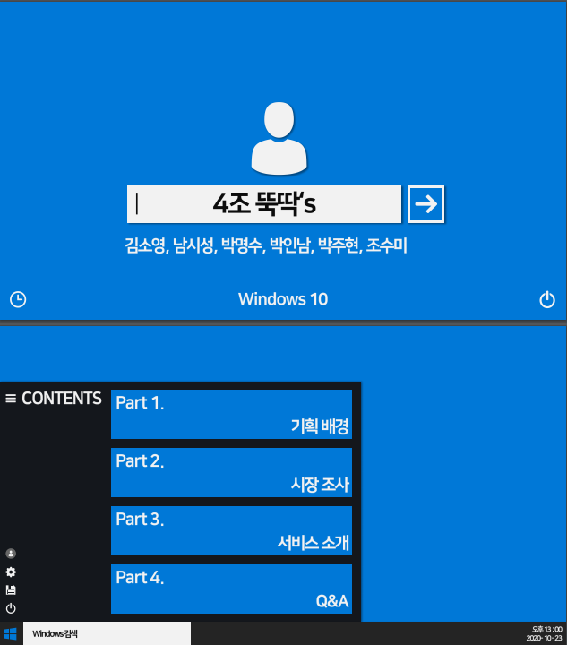
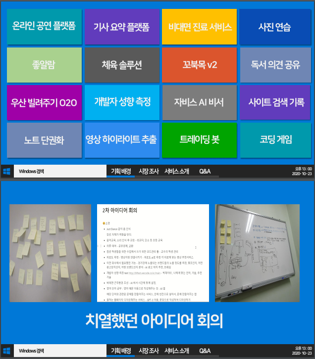
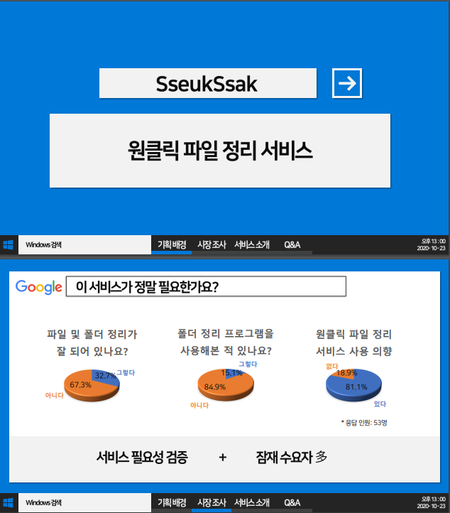
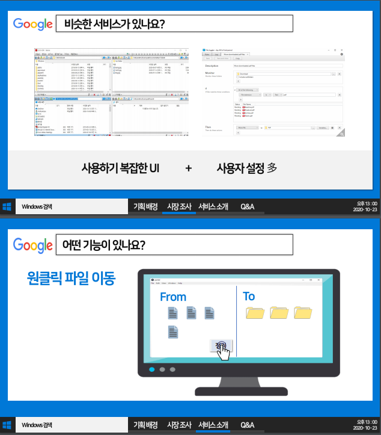
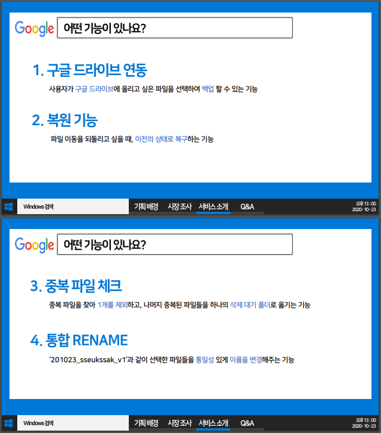
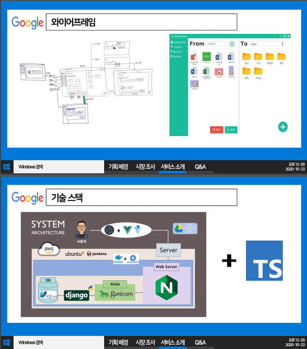
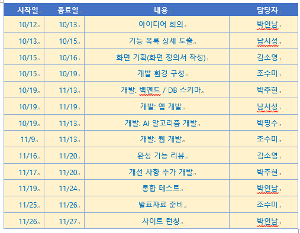

# 쓱싹!

## 1. 팀소개

#### 뚝딱's

박인남(팀장) : google API,AI 리네임
김소영 : UI, 미니모드, Mac 지원
남시성 : 파일 이동, 우클릭 메뉴, 드래그 앤 드랍 , 숏컷
박명수 : 중복제거, 히스토리
박주현 : web, 배포
조수미 : 리네임 기능, UI


## 2. 프로젝트 개요














## 2. 일정



## 3. 디렉토리 구조

- web/ : 웹페이지
- sseukssak/ : 데스크탑 앱
- study/ : 개발 사전 테스트 자료

## 4. 기능 소개
### 4-1) 상단 바 기능

도움말 

```
물음표 버튼의 아이콘을 클릭하여, 핵심 기능인 4가지 기능에 대한 설명을 도와줍니다.
해당되는 기능들은 다음과 같습니다.
- 메인 화면, 파일 정리, 파일/폴더명 통합 변경, 히스토리 
```

최소화

```
- 모양의 버튼을 클릭하여, 최소화 상태를 유지할 수 있습니다.
```

미니 모드

```
2개의 화살표가 있는 버튼을 클릭하여, 미니 모드를 활성화시킬 수 있습니다.
미니 모드가 활성화되면 정리 버튼과, 되돌리기 버튼만 시각적으로 보여집니다.
해당 버튼을 다시 클릭하여 해제 가능합니다.
```

종료

```
x자 모양의 버튼을 클릭하여, 쓱싹을 종료 가능합니다.
```


### 4-2 사이드 바 기능

웹사이트 이동

```
좌측 상단의 행주 모양 아이콘을 클릭하여, 웹사이트로 이동 가능합니다.
```

파일 정리로 이동

```
실행 시 기본적으로 나오는 화면입니다. 폴더 모양의 아이콘을 클릭하여, 여러 기준으로 폴더들을 정리할 수 있는 페이지로 넘어옵니다.
```

파일/폴더명 변경으로 이동

```
연필 모양 버튼을 클릭하여, 파일/폴더명 변경 페이지로 이동 가능합니다.
```

히스토리 페이지로 이동

```
시계 모양을 클릭하여, 히스토리 페이지로 이동 가능합니다.
```

퀵 버튼

```
- 좌측 하단의 번개 모양 아이콘을 클릭하여, 언제 어디서든 쓱싹의 정리 기준대로 파일들을 이동시킬 수 있습니다. 
- 원하는 정렬 기준을 선택한 후, 파일 탐색기의 원하는 폴더에서 마우스 우클릭을 누른 후 '여기서 쓱싹!'을 클릭하여 작동 가능합니다.
```

구글 드라이브 연동

```
- 좌측 하단의 구글 드라이브 아이콘을 선택하여, 구글 드라이브와 쓱싹 서비스를 연동할 수 있습니다.
- 구글 드라이브의 아이콘이 회색 상태인 경우, 현재 연동되지 않은 상태입니다.
- 구글 드라이브의 아이콘이 흰색 상태인 경우, 현재 연동된 상태입니다.
- 해당 버튼을 눌러, 연동할 계정을 선택할 수 있습니다.
- 고급-> 쓱싹(으)로 이동을 선택하고, 권한 부여를 허용시키면 인증 코드를 발급받을 수 있습니다. 해당 인증코드를 복사/붙여넣기하여 쓱싹과의 연동이 가능합니다.
- 구글 드라이브와 연동한 이후에는, TO 작업창에서 구글 드라이브의 디렉토리를 사용할 수 있습니다.
- 또한 FROM 작업창에서 파일/폴더를 우클릭하여, 구글 드라이브로의 백업 또한 가능합니다,
```


다크 모드

```
- 좌측 최하단의 달 모양 아이콘을 클릭하여, 다크 모드로 전환이 가능합니다.
- 다크 모드에서는 좌측 최하단의 해 아이콘을 클릭하여, 다크 모드 해제가 가능합니다.
```


### 4-3 메인 기능

파일 정리

* 파일 정리는 크게 FROM과 TO로 나뉘어집니다.

```
(( FROM ))
FROM의 상단에서 현재 작업중인 디렉토리가 표시됩니다. 
- FROM의 우측 상단에 위치한 폴더 아이콘을 선택하여, 원하는 디렉토리에서의 작업을 진행할 수 있습니다.
- 전체보기, 오늘 생성된, 오늘 수정된 기준으로, 파일을 선택하여 보는 것도 가능합니다.
- 새로고침을 통하여 간헐적으로 동기화가 되지 않은 경우, 해당 디렉토리를 새로 불러올 수 있습니다.

FROM에서 파일/폴더를 우클릭하여, 드롭다운 메뉴를 불러올 수 있습니다.
- 폴더 열기를 통하여, 해당 폴더를 쓱싹에서 작업 디렉토리로 설정 가능합니다.
- 중복 파일 제거를 통하여, 해당 폴더 내에 존재하는 중복 파일들을 간단하게 정리 가능합니다.
- 폴더명 바꾸기를 통하여, 해당 폴더의 이름을 바꿀 수 있습니다.
- 폴더 지우기를 통하여, 해당 폴더를 휴지통으로 이동시킵니다.
- 탐색기에서 열기를 통하여, 윈도우 탐색기를 통해 해당 폴더를 열 수 있습니다.
- 파일 실행을 통하여, 해당 파일을 실행할 수 있습니다.
- 파일 정보를 통하여, 해당 파일의 정보를 불러올 수 있습니다.

하단부의 중복제거, 정리, 되돌리기를 통하여 파일을 이동시킬 수 있습니다.
- 중복제거 체크박스를 통하여, 중복 파일들을 해당 디렉토리의 '중복된 파일' 폴더로 이동시킬 지의 여부를 결정할 수 있습니다.
- 정리 버튼을 클릭하여, TO에서 정해진 정리 방식대로 파일들을 정리 가능합니다.
- 되돌리기 버튼을 클릭하여, 직전에 정리 버튼을 눌러 이동한 파일들을 원 위치로 이동 가능합니다. 이 때, 중복 파일들은 이동하지 않습니다.
```

```
(( TO ))
TO에서는 기본적으로 유형별 정리라는 정리 프리셋이 주어집니다.
- 이미지, 문서, 비디오, 오디오, 압축파일, 바로가기의 폴더가 해당 종류의 파일이 있을 경우 자동으로 생성되며, 해당 분류에 해당하는 파일들을 FROM의 정리 버튼을 눌렀을 시 자동으로 이동시켜줍니다.

유저만의 정리 기준을 추가 버튼을 클릭하여 추가할 수 있습니다.
- 추가 버튼을 누르면, 새로운 정리 그룹 추가라는 창이 생성됩니다.
- 원하는 정리 그룹명을 적은 후, 그룹 추가 버튼을 누르면 새 그룹이 생성됩니다.

사용하지 않는 정리 기준은, 우측 상단의 삭제 버튼을 클릭하여 삭제가 가능합니다.
- 경고창이 한번 더 뜬 후, 확인 버튼을 누르면 해당 정리 기준은 삭제됩니다.

정리 기준에서 새로운 폴더를 추가 가능합니다.
- 폴더 추가 버튼 클릭, 윈도우 탐색기에서 TO로의 드래그 앤 드랍, FROM에서의 드래그 앤 드랍 모두 가능합니다.
- 폴더 추가라는 제목의 창이 뜨게 되며, 해당 창 내에서 새로운 폴더를 선택 가능합니다. 폴더 찾기를 클릭하면 윈도우 탐색기에 존재하는 새로운 폴더를 선택할 수 있고, 새 폴더 추가를 통해서 FROM 디렉토리에 새 폴더를 만들어 정리할 수도 있습니다.
- 폴더를 선택한 후, 정리할 기준 추가를 통해 해당 폴더에 넣을 파일의 형식을 선택할 수 있습니다. 파일 유형, 날짜, 파일명으로 선택이 가능합니다.

기준들을 선택하면, 하단에 총 정리 기준이라는 곳에 추가한 기준들이 등장하게 됩니다.
- 추가된 기준들은 X 버튼을 클릭하여, 잘못 추가했을 경우에 언제든지 취소할 수 있습니다.

모든 설정을 완료했다면, 폴더 추가 버튼을 눌러서 원하는 파일들을 넣는 폴더를 추가할 수 있습니다.
```


파일/폴더명 변경

- 한 폴더 내의 파일들을 원하는 기준에 따라 일괄적으로 이름 변경이 가능합니다.

```
변경할 파일/폴더를 선택할 수 있습니다.
- 우측 상단의 폴더 아이콘을 클릭하거나, 드래그 앤 드랍을 통하여 원하는 파일들을 불러올 수 있습니다.
- 상단에는 불러온 폴더의 위치가 노출됩니다.
- 여러 디렉토리에서 파일들을 불러온 경우, 마지막 파일을 불러온 위치를 노출시킵니다.

형식 설정을 통해, 원하는 방식으로 파일 이름을 변경할 수 있습니다.
- 머리말에는 생성 날짜, 사용자 입력, 머리말 없음을 선택할 수 있습니다.
- 파일/폴더명에는 기존 이름, 사용자 입력을 선택할 수 있습니다.
- 꼬리말에는 숫자(수정 날짜 오름차순), 사용자 입력, 꼬리말 없음을 선택할 수 있습니다.

하단의 확인 및 변경 창을 통하여, 변경 전 이름과 변경 후 이름을 한눈에 비교할 수 있습니다.

우측 하단의 변경 버튼을 클릭하여, 정한 방식대로 이름 변경이 가능합니다. 
- 이 때 바뀌는 이름과 동일한 파일명이 존재하는 경우, 경고 메시지가 출력됩니다.

기존 파일명으로 되돌리고 싶은 경우, 붉은색 되돌리기 버튼을 클릭하여 해당 작업을 취소할 수 있습니다.
```


히스토리

- 자신이 이동/변경시킨 파일들의 내역을 확인 가능합니다.

```
좌측 상단의 검색 기능을 사용하여, 원하는 파일의 이름을 빠르게 찾을 수 있습니다.

우측의 상단의 물음표 버튼을 클릭하여, 히스토리의 UI를 빠르고 쉽게 확인 가능합니다.
- 좌측의 박스 색상을 통해, 해당 파일이 어떤 작업이었는지 쉽게 확인 가능합니다.
- 파일 이동 : 회색, 중복 파일 체크 : 녹색, 파일 이름 변경 : 청색, 구글 드라이브 이동 : 보라
- 우측의 아이콘을 통해, 해당 작업의 결과를 쉽게 확인 가능합니다.
- 초록 원 : 성공, 붉은 경고 : 실패, 푸른색 되돌리기 : 복구 작업

작업 기록은 초 단위가 무시된 상태에서 내림차순으로 정렬되며, 작업한 파일을 클릭 시 세부 정보를 알 수 있습니다.
- 클릭 시 요약을 통해 어떤 작업이었는지 알 수 있습니다.
- 이동 전 위치, 이동 후 위치가 표시됩니다.

단일 파일을 클릭 시, 우측 하단의 갈색 되돌리기 버튼을 통하여 해당 파일에 행해진 작업을 취소 가능합니다.
- 변경 후의 위치에서, 변경 전의 위치로 되돌립니다.
- 해당 파일이 존재하지 않는 경우, 오류 메시지가 출력됩니다.
- 변경 전의 위치에 같은 이름의 파일명이 존재하는 경우, 경고 메시지가 출력됩니다.

우측 최하단의 붉은색 초기화 버튼을 클릭하여, 모든 히스토리 내역을 초기화 가능합니다.
- 초기화 진행 시 경고 메시지가 출력되며, 수락 시 모든 내역이 삭제됩니다.
```


-----

## 5. AI 연동 기능

5-1. 이미지 이름 자동 변경

```
파일 이동의 FROM에서 사용 가능한 기능입니다.

- 단일 이미지 혹은 폴더 우 클릭 시, 드롭다운 메뉴에서 해당 기능이 활성화됩니다.
- 해당 기능 클릭 시, 해당 폴더의 그림들 혹은 해당 이미지에 들어간 요소들을 분석하여 이름을 변경시킵니다.
```


5-2. 이미지 폴더 자동 정리

```
파일 이동의 FROM에서 사용 가능한 기능입니다.

- 폴더 우 클릭 시, 해당 기능이 활성화됩니다.
- 해당 기능 클릭 시, 폴더 내에 존재하는 이미지들에서 뽑아낸 요소들을 라디오박스 리스트로 변환시켜줍니다.
- 해당 리스트들 중에서 생성할 이미지 폴더를 선택할 수 있습니다. 
- 한 이미지가 여러 요소를 가지는 경우, 해당되는 모든 폴더에 복사되어 이동합니다.
- 완료 버튼을 누르면, AI에서 추출한 요소들을 가지는 이미지들이 모두 지정된 태그에 해당하는 폴더들로 이동한 것을 볼 수 있습니다.
```


2-3. AI 기반 폴더 태그 추천 & AI 이미지 식별

```
파일 이동의 TO에서 사용 가능한 기능입니다.

- 새 폴더를 추가하는 경우, 해당 폴더명을 AI가 분석합니다.
- 해당 폴더명에 AI가 추출 가능한 태그가 존재하는 경우, 해당 태그들을 추천해줍니다.
- 해당 폴더명이 AI를 사용하지 않는 기존 정리 기준이더라도, 해당 태그를 추천해줍니다.
- 추천 태그들은 2. 정리할 기준 추가의 하단부에 위치합니다.

추천받은 태그들을 클릭하는 경우, 선택 창으로 넘어갑니다.
- 파일명을 선택하는 경우, 해당 파일명에 해당 태그가 포함된 경우만 정리합니다.
- AI식별을 선택하는 경우, AI가 이미지에서 해당 태그를 찾을 경우 정리합니다.
- 이 두 기준은 하나만 적용시킬 수 있습니다.


폴더명이 해당 태그를 만족시키지 않더라도, 수동으로 AI식별 기준을 추가할 수 있습니다.
- 정리 기준에서 최하단의 AI 이미지 식별을 선택할 수 있습니다.
- 해당 기능 선택 시, 식별할 개체 입력을 통해 AI가 해당 개체를 식별 시 이동시킬 기준을 추가할 수 있습니다.
```

## 6. 배포
https://k3b304.p.ssafy.io/ 에서 다운로드 가능합니다.